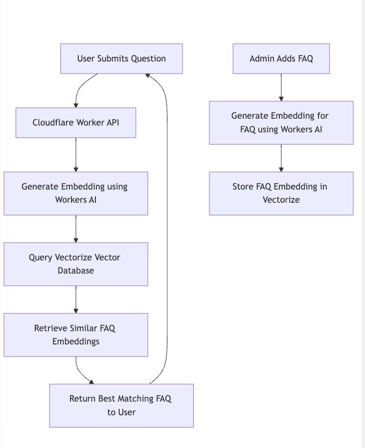

# FAQ Retrieval System with Cloudflare Workers and Vectorize

This project is a headless API system designed to manage Frequently Asked Questions (FAQs) using vector embeddings for semantic search. Built on Cloudflare’s serverless infrastructure, it leverages Workers AI for embedding generation and Vectorize as a vector database.

Features
	•	Question Matching: Submit a user question to retrieve the most relevant FAQ based on semantic similarity.
	•	Admin FAQ Management: Add new FAQs and store their embeddings in the vector database.
	•	Scalability: Powered by Cloudflare Workers for low-latency responses and global scalability.

## Architecture

